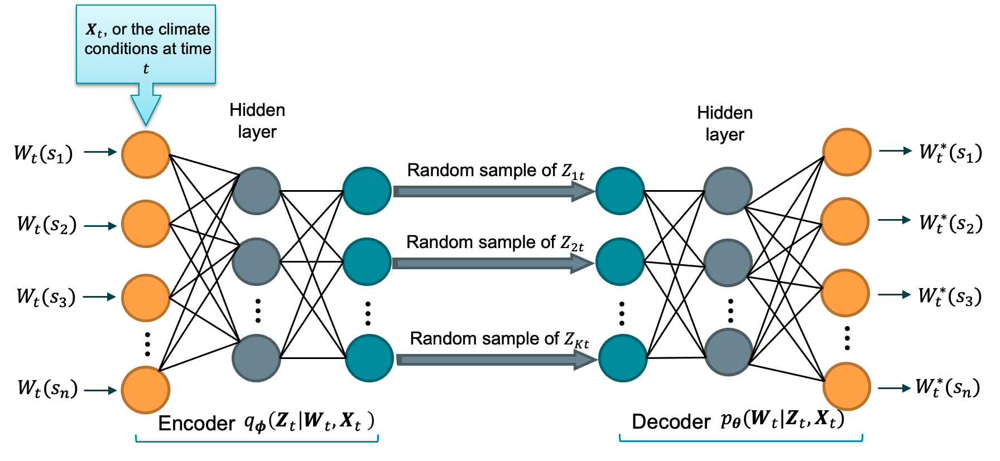

# extCVAE

## Department of Statistics, University of Missouri

Emulating complex climate models via integrating variational autoencoder and spatial extremes

### Max-divisible processes

our model is based on the max-infinitely divisible process proposed by Bopp et al. (2021) and allows for both short-range asymptotic independence and dependence along with long-range asymptotic independence, which can be specified as follows:
=\epsilon_t(\textbf{s})Y_t(\textbf{s}))
where _X_t(**s**)_ is a spatio-temporal output from a simulator (e.g., high-resolution climate model),  $\epsilon_t(\bs)$ is a white noise process with independent $(1/\alpha)$-Fr\'{e}chet marginal distribution, and _Y_t(**s**)_ is described by a low-rank representation:
!
    [equation](https://latex.codecogs.com/gif.image?\dpi{110}Y_t(\textbf{s})=\left(\sum_{k=1}^K \omega_k(\textbf{s}, r_k)^{1/\alpha}Z_{kt}\right)^\alpha.)
Here, we use compactly-supported Wendland basis functions &omega;_k(**s**, r_k), _k_=1,...,_K_, which are centered at _K_ pre-specified knots. The latent variables are lighter-tailed, exponentially tilted, positive-stable variables:
!
    [equation](https://latex.codecogs.com/gif.image?\dpi{110}Z_{kt}\sim H(\alpha,\alpha,\theta_k),\; k=1,\ldots, K,)
in which &alpha; &isin; (0,1) is the concentration parameter, and larger values of the tail index &theta;_k\geq 0 induce lighter-tailed distributions of _Z_{kt}_. 

### Conditional variational autoencoder

